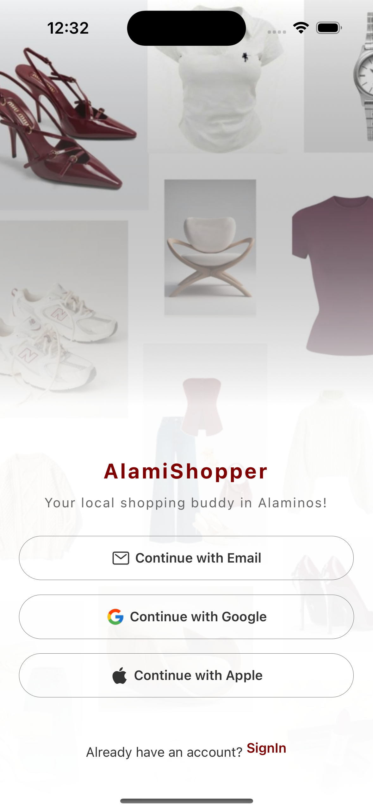
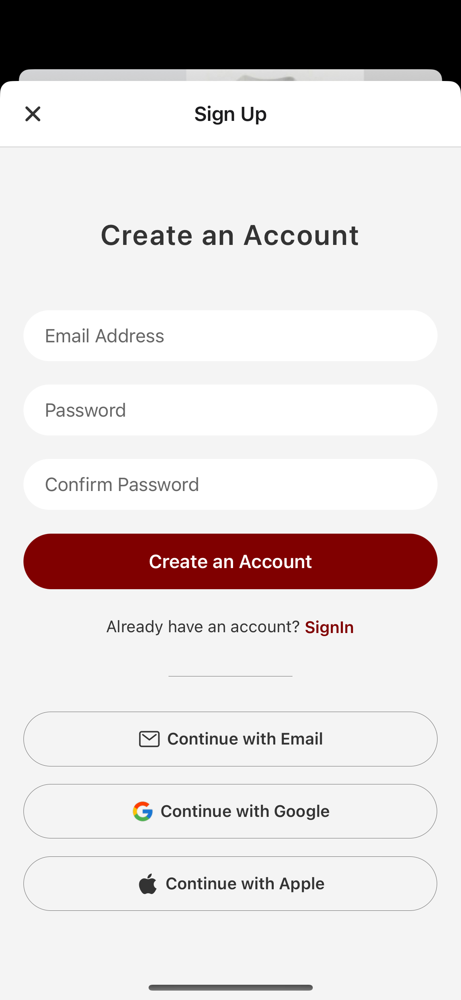
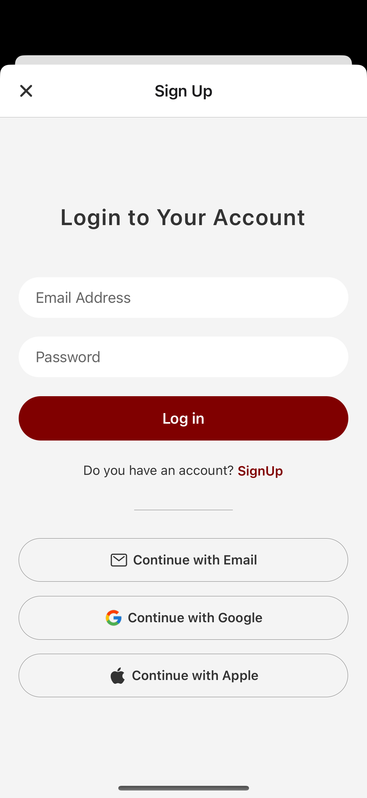
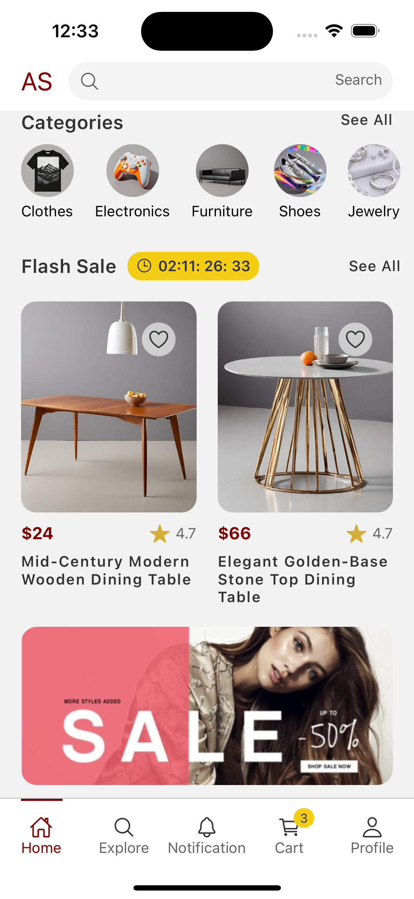
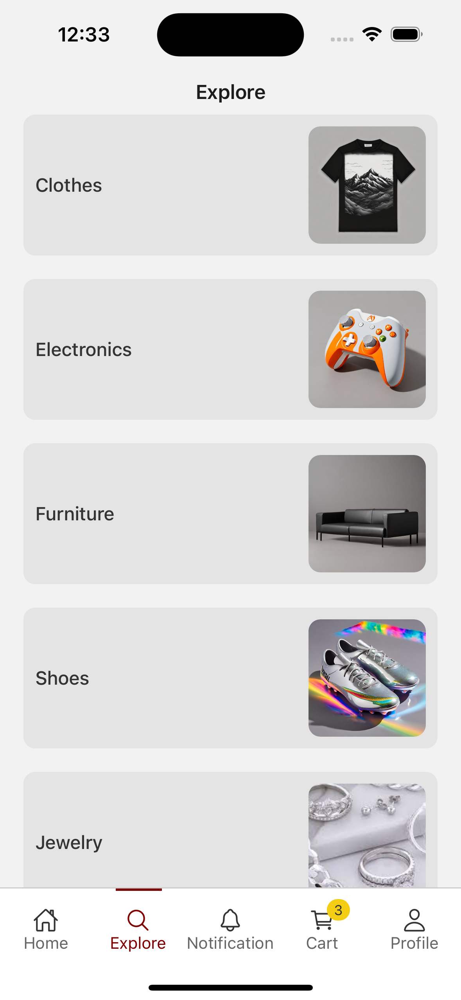
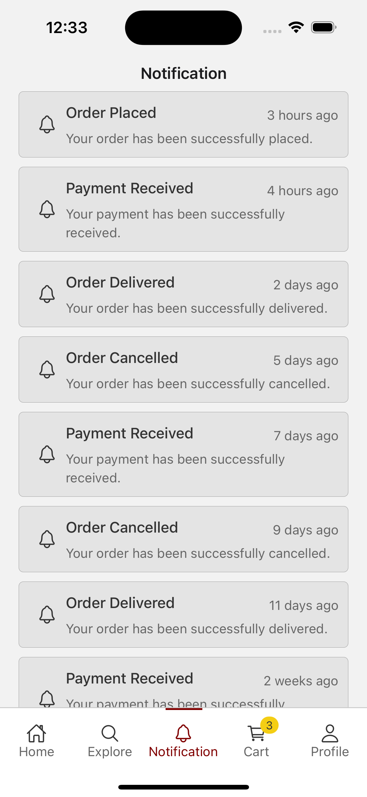
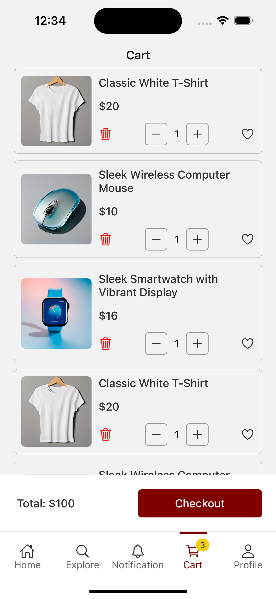
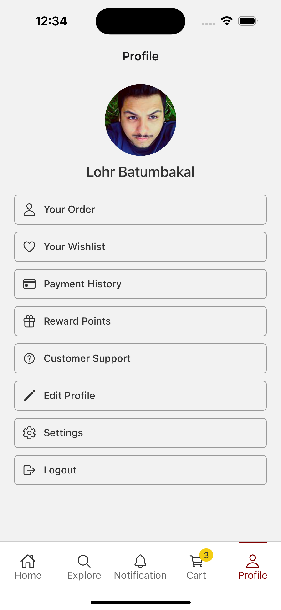

# AlamiShopper  

A community-based online shopping mobile app built with React Native and Expo.
This project focuses on providing a local marketplace exclusively for Alaminos City, Pangasinan. Where sellers can post products and buyers can shop conveniently within the City.  


## Features  
- Local sellers can post products (clothes, food, accessories, etc.)  
- Local buyers can purchase quickly within Alaminos City  
- Payment options: Cash on Delivery (COD), GCash, or meet-up  
- Simple delivery system within the community  
- Community-based online marketplace – like a virtual mall for Alaminos  


## Installation  
1. Clone the repository:  

   ```bash
   git clone https://github.com/miatresenio/AlamiShopper-EcommerceApp-Official.git


 Navigate to the project folder:
cd EcommerceApp

 Install dependencies:
npm install

 Run the app:
json-server —watch data/db.json
npx expo start


## Target Users
- Sellers → Small and medium entrepreneurs in Alaminos City.     
- Buyers → Residents looking for a convenient and local shopping experience.


## Roadmap
 User Authentication (login/register)
 Seller Dashboard
 Product Listings
 Order & Delivery Tracking
 Payment Integration (GCash, PayMaya, COD)
 Admin Panel (web)

 ## Future
 Need to add backend


## Developer:
Developed by Mia Myca N. Tresenio


## Screenshots  

  
  
  
  
  
  
  
  
  


## License

This project is licensed under the [MIT License](./LICENSE).
